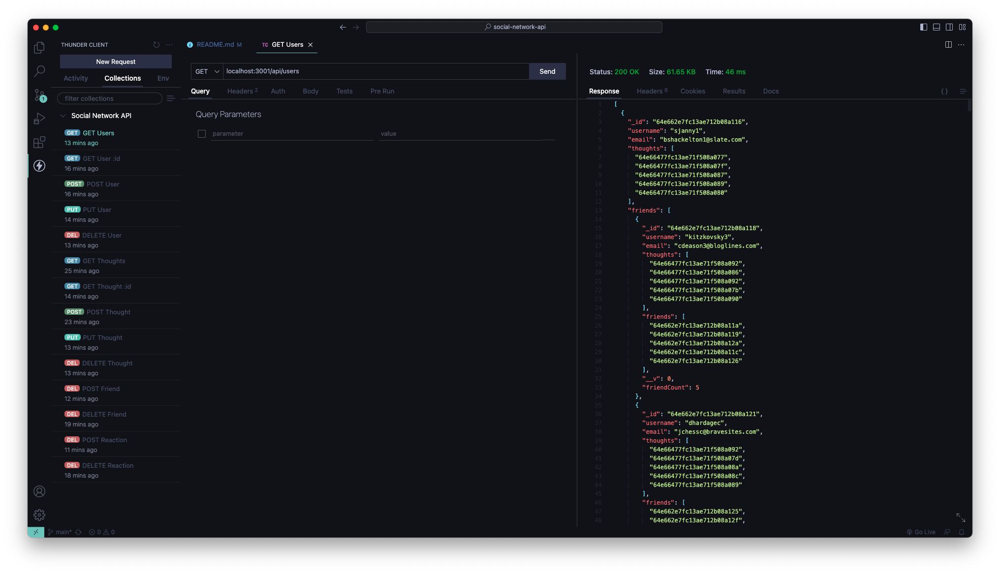

# 18 NoSQL: Social Network API

The goal was to create an API for a social network using a NoSQL database (MongoDB). The requirements were:
```md
- the command nodemon server.js starts the server and the Mongoose models are synced to the MongoDB database
- there are functioning GET, POST, PUT, and DELETE routes for the Users model
- there are functioning GET, POST, PUT, and DELETE routes for the Thoughts model
- there are functioning routes to POST and DELETE a friend from a User
- there are functioning routes to POST and DELETE a reaction from a Thought
```

## Usage 
1. In terminal: `npm install`
2. In terminal: `nodemon server.js` OR `node server.js`
3. Use `Insomnia` or `ThunderClient` to test routes

## Visual Example


## Video Walkthrough
[https://watch.screencastify.com/v/mrSNU3T7r7Jc89sWWltY](https://watch.screencastify.com/v/mrSNU3T7r7Jc89sWWltY)
